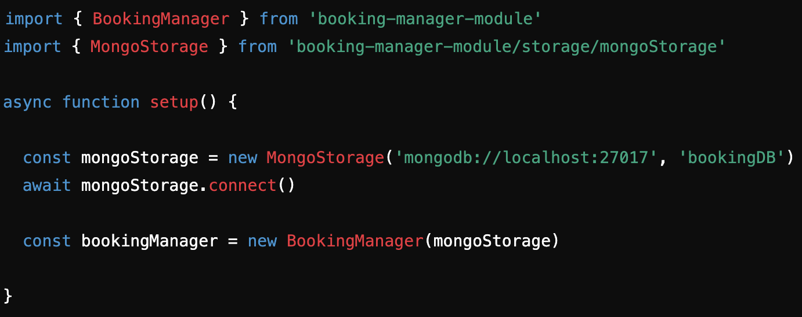

# BookingManager

## Overview
The Booking Manager module provides a flexible and reusable system for managing bookings, customers, and products. It is designed to be easily integrated with the a storage solution like MongoDB, enabling developers to add booking functionality to their applications.

Whether you're building an app for small businesses, appointment scheduling, or event management, this module provides a robust and adaptable backend for booking management.

## For users

### Installtion

To install the module run:
npm install booking-manager-module

### How to use the module

#### Configure Storage
The module is designed to work with different storage backends. By default, we provide a StorageInterface class that can be integrated with MongoDB or other solutions.

#### Initialize the BookingManager
To use the module, first initialize your chosen storage and pass it to the BookingManager. See example below:

#### API Documentation
The module offers the following public methods for managing bookings, products, and customers.

##### BookingManager API

addBooking(productId, customerId, date)
- Adds a new booking to the system.
- Returns: Booking object.

cancelBooking(bookingId)
- Removes a booking based on the provided ID.

getAllBookings()
- Retrieves all bookings stored in the system.
- Returns: An array of Booking objects.

getBookingById(bookingId)
- Retrieves a specific booking by its ID.
- Returns: Booking object.

addProduct(name, description, price)
- Adds a new product to the system.
- Returns: Product object.

removeProductById(productId)
- Removes a product based on the provided ID.

getAllProducts()
- Retrieves all products stored in the system.
- Returns: An array of Product objects.

addCustomer(name, email)
- Adds a new customer to the system.
- Returns: Customer object.

getAllCustomers()
- Retrieves all customers stored in the system.
- Returns: An array of Customer objects.

#### How to Start the Module

To start using the module:

- Ensure MongoDB is set up (see Dependencies).
- Use the MongoStorage class to connect the module to MongoDB, or implement your own storage that extends the StorageInterface.
- Dependencies
- Node.js (v14 or above)
- MongoDB (for persistence)
- Docker (for containerized setup)

#### You can get MongoDB and Docker running by following these links:

Install MongoDB: https://www.mongodb.com/try/download/community
Install Docker: https://www.docker.com/products/docker-desktop/

## For developers contributing to the project

###  Bug report

See issues in repository. 

### Design
.jpeg)
### CI/CD Flow
#### Linting: Code is linted on every push using ESLint.

#### Testing: Unit tests are run using Jest.

This project uses Jest as the testing framework for unit tests. Jest is a delightful JavaScript testing framework that focuses on simplicity. It provides a robust and user-friendly environment for testing JavaScript code, including asynchronous functions.

##### Prerequisites

Ensure you have the following installed before running the tests:

- Node.js (version 14 or higher)
- npm (Node package manager)
- Jest
- Babel

Run the test using: npm test

##### Writing Tests

- Location: Create your test files in the __tests__ directory or in the same directory as the module you are testing, using the naming convention *.test.js.

- Structure: Each test file should import the module to be tested and Jest's testing functions. Here's an example of a basic test structure:

- Mocking Dependencies: In your tests, you may need to mock dependencies to isolate the code being tested. Jest provides a powerful mocking system to simulate the behavior of modules and functions. Use jest.fn() to create mock functions and control their return values.

#### Docker Build: A Docker image is built automatically and tested in a containerized environment.

#### Deployment: The module is published to npm upon passing all checks.

#### To contribute, please:

- Fork the repository
- Create a feature branch
- Ensure all tests pass
- Open a pull request for review

